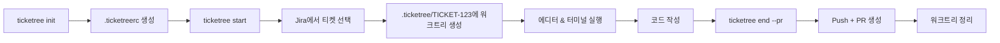

# Ticketree

Jira 티켓과 Git Worktree를 연결하여 티켓 기반 개발 워크플로우를 지원하는 CLI 도구.

## 배경

IntelliJ의 [Task and Context](https://www.jetbrains.com/help/idea/managing-tasks-and-context.html) 기능에서 영감을 받아 만들었습니다. Jira와 연동하여 브랜치를 자동 생성하고, 컨텍스트(열린 탭, 도구 창)를 저장/복원하며, changelist로 커밋되지 않은 변경사항을 관리해줍니다. 작업 간 전환에 적합한 도구입니다.

하지만 IntelliJ IDE에서만 사용할 수 있습니다.

Ticketree는 다른 접근 방식을 취합니다. [Git Worktree](https://git-scm.com/docs/git-worktree)를 사용하여 티켓별 독립 디렉토리를 생성하고, 작업 전환 없이 병렬로 작업할 수 있게 합니다.

```bash
npx ticketree start TICKET-456  # .ticketree/TICKET-456 생성
npx ticketree start TICKET-123  # .ticketree/TICKET-123 생성
# 두 디렉토리가 동시에 존재 - 전환 불필요
```

## 기능

- 티켓별 독립 worktree 생성
- Jira에서 할당된 티켓 조회
- Jira 이슈 상태 자동 전이
- 작업 완료 시 GitHub PR 생성
- 에디터 및 터미널 자동 실행

## 테스트 환경

다음 환경에서 테스트되었습니다:

- **OS**: macOS Tahoe 26
- **에디터**: VS Code

다른 환경에서도 동작할 수 있으나 보장하지 않습니다.

## 사전 요구사항

- Node.js >= 20.10.0
- Jira Cloud 계정 및 API 토큰
- GitHub 토큰 (선택, PR 생성용)

## 빠른 시작

```bash
# 프로젝트 초기화
npx ticketree init

# 티켓 작업 시작
npx ticketree start

# 완료 후 Push 및 PR 생성
npx ticketree end --pr
```

`bunx`, `pnpx`로도 실행 가능합니다.

## 동작 방식



## 명령어

### `ticketree init`

프로젝트에 Ticketree를 초기화합니다.

- `.ticketreerc` 설정 파일 생성
- `.ticketree/` 워크트리 디렉토리 생성
- Jira 연결 테스트

### `ticketree start [ticket]`

티켓 작업을 시작합니다.

| 인자     | 필수 | 설명                                   |
| -------- | ---- | -------------------------------------- |
| `ticket` | X    | 티켓 키 (예: `PROJ-123`) 또는 Jira URL |

동작:

1. 티켓 미지정 시 할당된 이슈 목록에서 선택
2. `.ticketree/<TICKET-KEY>`에 워크트리 생성
3. 설정된 심볼릭 링크 생성 (예: `node_modules`, `.env`)
4. Jira 이슈 상태 전이 (설정 시)
5. 에디터 및 터미널 실행

### `ticketree list`

활성화된 워크트리와 티켓 정보를 표시합니다.

출력 정보:

- 티켓 키 및 요약
- 현재 상태
- 브랜치 이름
- 워크트리 경로

### `ticketree end [ticket]`

티켓 작업을 종료합니다.

| 인자/옵션         | 필수 | 설명                                     |
| ----------------- | ---- | ---------------------------------------- |
| `ticket`          | X    | 티켓 키 (현재 디렉토리에서 자동 감지)    |
| `--pr`            | X    | GitHub Pull Request 생성                 |
| `--no-draft`      | X    | PR을 리뷰 준비 상태로 생성 (기본: draft) |
| `--base <branch>` | X    | PR 대상 브랜치 (기본: 설정 파일)         |
| `--keep`          | X    | 종료 후 워크트리와 브랜치 유지           |

동작:

1. 브랜치를 원격에 Push
2. GitHub PR 생성 (`--pr` 사용 시)
3. Jira 이슈 상태 전이 (설정 시)
4. 워크트리 및 로컬 브랜치 삭제 (`--keep` 미사용 시)

## 설정

`.ticketreerc` (YAML 형식)로 설정합니다.

### 예시

```yaml
issueTracker:
  type: jira
  jira:
    project: PROJ
    jql: 'assignee = currentUser() AND resolution = Unresolved'

git:
  baseBranch: main
  branchPrefix: 'feature/'
  github:
    prBodyTemplate: |
      ## 관련 이슈
      {issueLink}

postCreate:
  symlinks:
    - node_modules
    - source: .env.local
      target: .env

editor:
  enabled: true
  command: code

terminal:
  enabled: true
  preset: ghostty

issueTransition:
  onStart: 'In Progress'
  onEnd: null
```

### 설정 레퍼런스

| 섹션              | 설명                           |
| ----------------- | ------------------------------ |
| `issueTracker`    | Jira 프로젝트 및 JQL 필터 설정 |
| `git`             | 브랜치 네이밍 및 PR 템플릿     |
| `postCreate`      | 워크트리에 생성할 심볼릭 링크  |
| `editor`          | 에디터 실행 설정               |
| `terminal`        | 터미널 실행 설정               |
| `issueTransition` | 시작/종료 시 Jira 상태 전이    |

### PR 본문 템플릿 변수

| 변수             | 설명          | 예시                                            |
| ---------------- | ------------- | ----------------------------------------------- |
| `{issueKey}`     | 티켓 키       | `PROJ-123`                                      |
| `{issueLink}`    | 마크다운 링크 | `[PROJ-123](https://...)`                       |
| `{issueSummary}` | 티켓 제목     | `로그인 버그 수정`                              |
| `{issueUrl}`     | 전체 Jira URL | `https://company.atlassian.net/browse/PROJ-123` |

## 환경 변수

| 변수             | 필수 | 설명                                                 |
| ---------------- | ---- | ---------------------------------------------------- |
| `JIRA_BASE_URL`  | O    | Jira Cloud URL (예: `https://company.atlassian.net`) |
| `JIRA_EMAIL`     | O    | Jira 계정 이메일                                     |
| `JIRA_API_TOKEN` | O    | Jira API 토큰                                        |
| `GITHUB_TOKEN`   | X    | GitHub Personal Access Token (PR 생성용)             |
| `DEBUG`          | X    | `1` 설정 시 상세 에러 출력                           |

### Jira API 토큰 발급

1. [Atlassian API 토큰 관리](https://id.atlassian.com/manage-profile/security/api-tokens)로 이동
2. "API 토큰 만들기" 클릭
3. `JIRA_API_TOKEN` 환경 변수로 설정

환경 변수 관리에는 [direnv](https://direnv.net/) 사용을 권장합니다.

## 지원 터미널

| 터미널       | 상태   |
| ------------ | ------ |
| Ghostty      | 지원   |
| iTerm        | 미지원 |
| Warp         | 미지원 |
| Kitty        | 미지원 |
| Alacritty    | 미지원 |
| Terminal.app | 미지원 |

## 라이선스

MIT

---

[English](./README.md)
