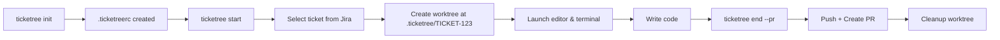

# Ticketree

CLI tool that connects Jira tickets with Git Worktree for ticket-based development workflow.

## Background

This project was inspired by IntelliJ's [Task and Context](https://www.jetbrains.com/help/idea/managing-tasks-and-context.html) feature. It integrates with Jira, automatically creates branches, saves/restores context (open tabs, tool windows), and manages uncommitted changes via changelists. Great for switching between tasks.

But it only works in IntelliJ IDEs.

Ticketree takes a different approach using [Git Worktree](https://git-scm.com/docs/git-worktree). Instead of switching between tasks, it creates isolated directories per ticket, enabling true parallel work.

```bash
npx ticketree start TICKET-456  # Creates .ticketree/TICKET-456
npx ticketree start TICKET-123  # Creates .ticketree/TICKET-123
# Both directories exist simultaneously - no switching needed
```

## Features

- Creates isolated worktree per ticket
- Fetches assigned tickets from Jira
- Auto-transitions Jira issue status
- Creates GitHub PR on completion
- Launches editor and terminal automatically

## Tested Environment

This tool has been tested on:

- **OS**: macOS Tahoe 26
- **Editor**: VS Code

Other environments may work but are not guaranteed.

## Prerequisites

- Node.js >= 20.10.0
- Jira Cloud account with API token
- GitHub token (optional, for PR creation)

## Quick Start

```bash
# Initialize in your project
npx ticketree init

# Start working on a ticket
npx ticketree start

# When done, push and create PR
npx ticketree end --pr
```

Also works with `bunx` or `pnpx`.

## How It Works



## Commands

### `ticketree init`

Initialize Ticketree in your project.

- Creates `.ticketreerc` configuration file
- Creates `.ticketree/` directory for worktrees
- Tests Jira connection

### `ticketree start [ticket]`

Start working on a ticket.

| Argument | Required | Description                               |
| -------- | -------- | ----------------------------------------- |
| `ticket` | X        | Ticket key (e.g., `PROJ-123`) or Jira URL |

What it does:

1. If no ticket specified, shows interactive picker with assigned issues
2. Creates worktree at `.ticketree/<TICKET-KEY>`
3. Creates configured symlinks (e.g., `node_modules`, `.env`)
4. Transitions Jira issue status (if configured)
5. Opens editor and terminal

### `ticketree list`

List all active worktrees with ticket information.

Output includes:

- Ticket key and summary
- Current status
- Branch name
- Worktree path

### `ticketree end [ticket]`

End work on a ticket.

| Argument/Option   | Required | Description                                       |
| ----------------- | -------- | ------------------------------------------------- |
| `ticket`          | X        | Ticket key (auto-detected from current directory) |
| `--pr`            | X        | Create GitHub Pull Request                        |
| `--no-draft`      | X        | Create PR as ready for review (default: draft)    |
| `--base <branch>` | X        | Target branch for PR (default: from config)       |
| `--keep`          | X        | Keep worktree and branch after ending             |

What it does:

1. Pushes branch to remote
2. Creates GitHub PR (if `--pr` flag)
3. Transitions Jira issue status (if configured)
4. Removes worktree and local branch (unless `--keep`)

## Configuration

Ticketree uses `.ticketreerc` (YAML format) for project configuration.

### Example

```yaml
issueTracker:
  type: jira
  jira:
    defaultProject: PROJ
    projects:
      PROJ:
        jql: 'assignee = currentUser() AND resolution = Unresolved'
        transition:
          onStart: 'In Progress'
          onEnd: null
      # Multiple projects with different workflows
      PLATFORM:
        jql: 'assignee = currentUser() AND sprint in openSprints()'
        transition:
          onStart: 'In Development'
          onEnd: 'In Review'

git:
  baseBranch: main
  branchPrefix: 'feature/'
  github:
    prBodyTemplate: |
      ## Related Issue
      {issueLink}

postCreate:
  symlinks:
    - node_modules
    - source: .env.local
      target: .env

editor:
  enabled: true
  command: code

terminal:
  enabled: true
  preset: ghostty
```

### Configuration Reference

| Section        | Description                           |
| -------------- | ------------------------------------- |
| `issueTracker` | Jira projects and JQL filter settings |
| `git`          | Branch naming and PR template         |
| `postCreate`   | Symlinks to create in new worktrees   |
| `editor`       | Editor launch settings                |
| `terminal`     | Terminal launch settings              |

### Jira Configuration

| Option                           | Description                                  |
| -------------------------------- | -------------------------------------------- |
| `jira.defaultProject`            | Default project for ticket number-only input |
| `jira.projects.<KEY>.jql`        | JQL filter for fetching issues               |
| `jira.projects.<KEY>.transition` | Status transitions for this project          |
| `transition.onStart`             | Status to transition when starting work      |
| `transition.onEnd`               | Status to transition when ending work        |

### PR Body Template Variables

| Variable         | Description   | Example                                         |
| ---------------- | ------------- | ----------------------------------------------- |
| `{issueKey}`     | Ticket key    | `PROJ-123`                                      |
| `{issueLink}`    | Markdown link | `[PROJ-123](https://...)`                       |
| `{issueSummary}` | Ticket title  | `Fix login bug`                                 |
| `{issueUrl}`     | Full Jira URL | `https://company.atlassian.net/browse/PROJ-123` |

## Environment Variables

| Variable         | Required | Description                                            |
| ---------------- | -------- | ------------------------------------------------------ |
| `JIRA_BASE_URL`  | O        | Jira Cloud URL (e.g., `https://company.atlassian.net`) |
| `JIRA_EMAIL`     | O        | Jira account email                                     |
| `JIRA_API_TOKEN` | O        | Jira API token                                         |
| `GITHUB_TOKEN`   | X        | GitHub Personal Access Token (for PR creation)         |
| `DEBUG`          | X        | Set to `1` for verbose error output                    |

### Jira API Token

1. Go to [Atlassian API Token Management](https://id.atlassian.com/manage-profile/security/api-tokens)
2. Click "Create API token"
3. Set as `JIRA_API_TOKEN` environment variable

Using [direnv](https://direnv.net/) is recommended for managing environment variables.

## Supported Terminals

| Terminal     | Status    |
| ------------ | --------- |
| Ghostty      | Supported |
| iTerm        | Not yet   |
| Warp         | Not yet   |
| Kitty        | Not yet   |
| Alacritty    | Not yet   |
| Terminal.app | Not yet   |

## Config Migration

If you're using the legacy config format (v0.3 or earlier), update to the new structure:

### Before (Legacy)

```yaml
issueTracker:
  type: jira
  jira:
    project: PROJ
    jql: 'assignee = currentUser() AND resolution = Unresolved'

issueTransition:
  onStart: 'In Progress'
  onEnd: null
```

### After (Current)

```yaml
issueTracker:
  type: jira
  jira:
    defaultProject: PROJ
    projects:
      PROJ:
        jql: 'assignee = currentUser() AND resolution = Unresolved'
        transition:
          onStart: 'In Progress'
          onEnd: null
```

The legacy format is still supported with automatic migration, but you'll see a warning message.

## License

MIT

---

[한국어](./README.ko.md)
